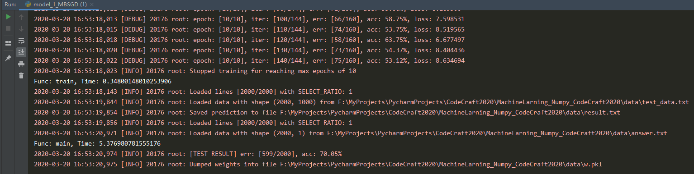
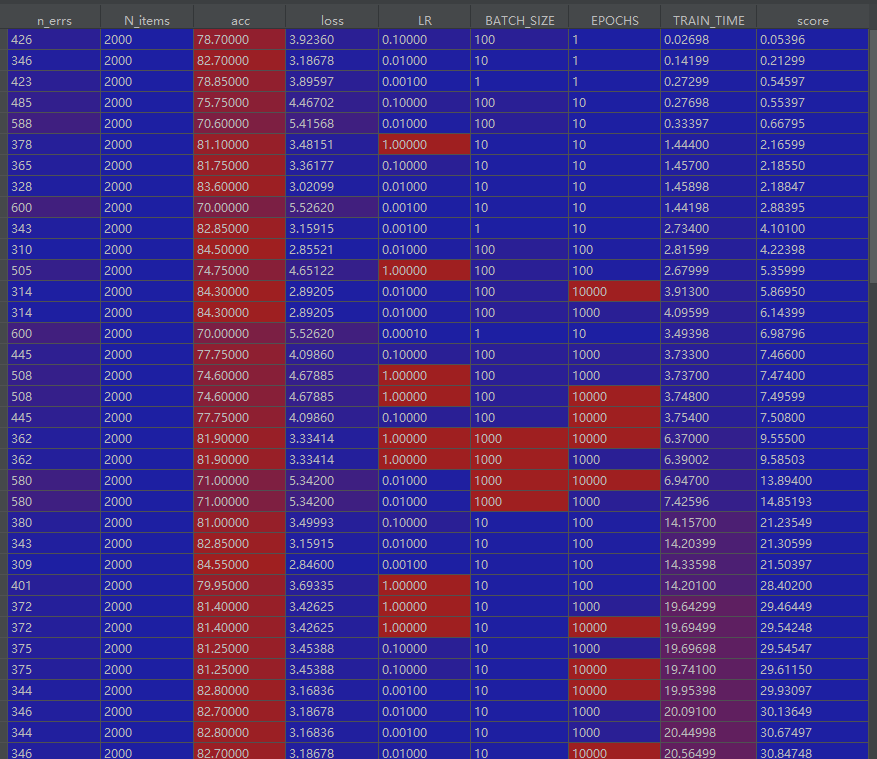

# MachineLarning_Numpy_CodeCraft2020

### 使用说明
#### 1. 导入项目
我们默认您使用PyCharm软件，并且有一个本地项目YOUR_PROJECT

在您的YOUR_PROJECT项目内，打开terminal，输入
`git clone https://github.com/MarkShawn2020/MachineLarning_Numpy_CodeCraft2020`
即可将本项目作为一个Package导入到您的项目内。

当然了，如果您的项目本身已经是一个git项目，
我们推荐您使用
``git submodule add https://github.com/MarkShawn2020/MachineLarning_Numpy_CodeCraft2020``，
两者都会在您的项目下生成一个`MachineLearning_Numpy_CodeCraft2020`文件夹，
以下简称`MNC`。

#### 2. 配置数据
将华为官方的数据，即`train_data.txt`,`test_data.txt`,`answer.txt`，
一起放入`MNC`文件夹下的`data`文件夹内，
考虑到git的拉取速度，这些文件我们没有上传。

此外，您的本地程序生成的预测文件`result.txt`也会自动存储在`data`文件夹下。

#### 3. 测试程序
RUN `demo/Model_1_MBSGD.py`，预期输出：

如果您想通过termina运行基于导入的项目，
请在程序开头使用`import sys; sys.path.app....`
此类项目路径设置，具体可以Google一下。
或者参考我们发布程序，使用脚本替换。

#### 4. 发布程序
如果您的程序测试通过，
可以使用`scripts/convert.py`文件将其自动转换成单文件版本，
而无需您手动修改包的导入，这是本项目最大的福利之一。

之后您可以直接将`release/Main.py`文件上传到服务器，
或者本地运行`python release/Main.py`。

Good Luck！

## 项目说明
本项目部分参考`PYTORCH`的框架设计。

目前已经实现：
- 基于生成器、自动切片、随机打乱、可自由分割训练集和验证集的DataLoader
- 继承于通用模型类的LogisticRegression类
- 一些常用的functions如交叉熵等
- 本地和服务器均可使用的路径配置
- 一些装饰器，如函数计时等

### 使用简单随机梯度下降Logistic测试结果

### TODO
- [ ] 融合一些高级优化器
- [ ] 加入其他模型
- [ ] 其他扩展与性能优化

### 最后声明
考虑到Python可能对最后的成绩没有什么决定性作用，
但大家可以一起学习研究，所以开源给大家使用
也欢迎大家积极贡献代码和issue，感谢~